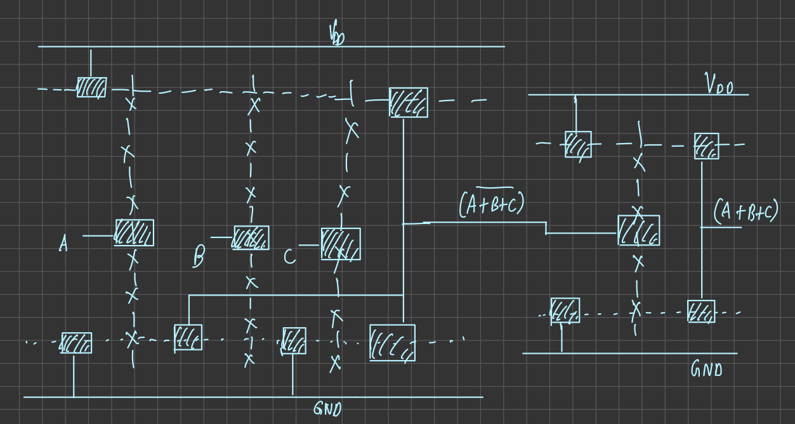

---
geometry:

- top=25mm
- left=25mm
- right=25mm
- heightrounded 
...

\clearpage
\tableofcontents
\clearpage

## Proposed Structure
The layout is a gate level implementation of a 4 bit Carry Lookahead Full Adder. In essence, this layout seeks to reduce the delay that is incurred as a result of carry propagation in a regular ripple adder. This is accomplished by adding two intermediate parameters to each bit: $p_i$ and $gi$. These are the **carry propagate** and **generate** respectively. They allow us to calculate the carry at each bit and give us the sum bits without waiting for the previous sum bit to be evaluated. But this comes at a cost- increased layout complexity and additional transistors for the computation of $p_i$ and $g_i$.

The layout implemented has been done bitwise, with four parameters being calculated at each stage:
- $p_i$ is the carry propagate, and is given by $a_i\oplus b_i$
- $g_i$ is the carry generate, and is given by $a_i\cdot b_i$
- $s_i$ is the sum bit, and is given by $p_i\oplus c_i$
- $c_{i+1}$ is the carry out of the $i^{th}$ bit. In our implementation, $c_0$ is taken to be zero.

In the layout, one can see four distinct rows to indicate these four values correstponding to each bit.

##Dimensions of Gates
The gates have been implemented using CMOS logic, and their sizes are as follows:

| Gate | Dimensions |
| --- | --- |
| AND (2) | 75 x 91 |
| AND (3) | 91 x 91 |
| AND (4) |93 x 90 |
| OR (2) | 63 x 88|
| OR (3) | 82 x 89|
| OR (4) |108 x 89 |
|XOR (2)|104 x 102|

## Blockwise Simulation and Verification
The two input AND, OR and XOR gates have been simulated and and their outputs verified in the report of Assignment 3.

## Stick Diagrams
### AND Gates


### OR Gates




### XOR Gate


## Pre Layout Simulations and Results

### Code
```c++
.include TSMC_180nm.txt
.param SUPPLY=1.8
.param LAMBDA=0.09u
.global gnd vdd

Vdd    vdd    gnd    1.8

vC cin gnd 0

vA0 a0 gnd pulse 1.8 0 0ns 0ns 0ns 10ns 20ns
vA1 a1 gnd pulse 1.8 0 0ns 0ns 0ns 20ns 40ns
vA2 a2 gnd pulse 1.8 0 0ns 0ns 0ns 40ns 80ns
vA3 a3 gnd pulse 1.8 0 0ns 0ns 0ns 80ns 160ns

vB0 b0 gnd pulse 1.8 0 0ns 0ns 0ns 160ns 320ns
vB1 b1 gnd pulse 0 1.8 0ns 0ns 0ns 320ns 640ns
vB2 b2 gnd pulse 1.8 0 0ns 0ns 0ns 640ns 1280ns
vB3 b3 gnd pulse 0 1.8 0ns 0ns 0ns 1280ns 2560ns

.subckt and2 A B vout vdd gnd
.param width_P={48*LAMBDA}
.param width_N={20*LAMBDA}

M1 1 A vdd vdd CMOSP W={width_P} L={2*LAMBDA} 
+ AS={5*width_P*LAMBDA} PS={10*LAMBDA+2*width_P}
+ AD={5*width_P*LAMBDA} PD={10*LAMBDA+2*width_P}
M2 1 B vdd vdd CMOSP W={width_P} L={2*LAMBDA} 
+ AS={5*width_P*LAMBDA} PS={10*LAMBDA+2*width_P}
+ AD={5*width_P*LAMBDA} PD={10*LAMBDA+2*width_P}

M3 1 A 2 gnd CMOSN W={width_N} L={2*LAMBDA} 
+ AS={5*width_N*LAMBDA} PS={10*LAMBDA+2*width_N}
+ AD={5*width_N*LAMBDA} PD={10*LAMBDA+2*width_N}
M4 2 B gnd gnd CMOSN W={width_N} L={2*LAMBDA} 
+ AS={5*width_N*LAMBDA} PS={10*LAMBDA+2*width_N}
+ AD={5*width_N*LAMBDA} PD={10*LAMBDA+2*width_N}

M5 vout 1 vdd vdd CMOSP W={width_P} L={2*LAMBDA} 
+ AS={5*width_P*LAMBDA} PS={10*LAMBDA+2*width_P}
+ AD={5*width_P*LAMBDA} PD={10*LAMBDA+2*width_P}
M6 vout 1 gnd gnd CMOSN W={width_N} L={2*LAMBDA} 
+ AS={5*width_N*LAMBDA} PS={10*LAMBDA+2*width_N}
+ AD={5*width_N*LAMBDA} PD={10*LAMBDA+2*width_N}
.ends and2

.subckt and3 A B C vout vdd gnd
.param width_P={48*LAMBDA}
.param width_N={20*LAMBDA}

M1 1 A vdd vdd CMOSP W={width_P} L={2*LAMBDA} 
+ AS={5*width_P*LAMBDA} PS={10*LAMBDA+2*width_P}
+ AD={5*width_P*LAMBDA} PD={10*LAMBDA+2*width_P}
M2 1 B vdd vdd CMOSP W={width_P} L={2*LAMBDA} 
+ AS={5*width_P*LAMBDA} PS={10*LAMBDA+2*width_P}
+ AD={5*width_P*LAMBDA} PD={10*LAMBDA+2*width_P}
M7 1 C vdd vdd CMOSP W={width_P} L={2*LAMBDA} 
+ AS={5*width_P*LAMBDA} PS={10*LAMBDA+2*width_P}
+ AD={5*width_P*LAMBDA} PD={10*LAMBDA+2*width_P}

M3 1 A 2 gnd CMOSN W={width_N} L={2*LAMBDA} 
+ AS={5*width_N*LAMBDA} PS={10*LAMBDA+2*width_N}
+ AD={5*width_N*LAMBDA} PD={10*LAMBDA+2*width_N}
M4 2 B 3 gnd CMOSN W={width_N} L={2*LAMBDA} 
+ AS={5*width_N*LAMBDA} PS={10*LAMBDA+2*width_N}
+ AD={5*width_N*LAMBDA} PD={10*LAMBDA+2*width_N}
M8 3 C gnd gnd CMOSN W={width_N} L={2*LAMBDA} 
+ AS={5*width_N*LAMBDA} PS={10*LAMBDA+2*width_N}
+ AD={5*width_N*LAMBDA} PD={10*LAMBDA+2*width_N}

M5 vout 1 vdd vdd CMOSP W={width_P} L={2*LAMBDA} 
+ AS={5*width_P*LAMBDA} PS={10*LAMBDA+2*width_P}
+ AD={5*width_P*LAMBDA} PD={10*LAMBDA+2*width_P}
M6 vout 1 gnd gnd CMOSN W={width_N} L={2*LAMBDA} 
+ AS={5*width_N*LAMBDA} PS={10*LAMBDA+2*width_N}
+ AD={5*width_N*LAMBDA} PD={10*LAMBDA+2*width_N}
.ends and3

.subckt and4 A B C D vout vdd gnd
.param width_P={48*LAMBDA}
.param width_N={20*LAMBDA}

M1 1 A vdd vdd CMOSP W={width_P} L={2*LAMBDA} 
+ AS={5*width_P*LAMBDA} PS={10*LAMBDA+2*width_P}
+ AD={5*width_P*LAMBDA} PD={10*LAMBDA+2*width_P}
M2 1 B vdd vdd CMOSP W={width_P} L={2*LAMBDA} 
+ AS={5*width_P*LAMBDA} PS={10*LAMBDA+2*width_P}
+ AD={5*width_P*LAMBDA} PD={10*LAMBDA+2*width_P}
M7 1 C vdd vdd CMOSP W={width_P} L={2*LAMBDA} 
+ AS={5*width_P*LAMBDA} PS={10*LAMBDA+2*width_P}
+ AD={5*width_P*LAMBDA} PD={10*LAMBDA+2*width_P}
M9 1 D vdd vdd CMOSP W={width_P} L={2*LAMBDA} 
+ AS={5*width_P*LAMBDA} PS={10*LAMBDA+2*width_P}
+ AD={5*width_P*LAMBDA} PD={10*LAMBDA+2*width_P}

M3 1 A 2 gnd CMOSN W={width_N} L={2*LAMBDA} 
+ AS={5*width_N*LAMBDA} PS={10*LAMBDA+2*width_N}
+ AD={5*width_N*LAMBDA} PD={10*LAMBDA+2*width_N}
M4 2 B 3 gnd CMOSN W={width_N} L={2*LAMBDA} 
+ AS={5*width_N*LAMBDA} PS={10*LAMBDA+2*width_N}
+ AD={5*width_N*LAMBDA} PD={10*LAMBDA+2*width_N}
M8 3 C 4 gnd CMOSN W={width_N} L={2*LAMBDA} 
+ AS={5*width_N*LAMBDA} PS={10*LAMBDA+2*width_N}
+ AD={5*width_N*LAMBDA} PD={10*LAMBDA+2*width_N}
M10 4 D gnd gnd CMOSN W={width_N} L={2*LAMBDA} 
+ AS={5*width_N*LAMBDA} PS={10*LAMBDA+2*width_N}
+ AD={5*width_N*LAMBDA} PD={10*LAMBDA+2*width_N}

M5 vout 1 vdd vdd CMOSP W={width_P} L={2*LAMBDA} 
+ AS={5*width_P*LAMBDA} PS={10*LAMBDA+2*width_P}
+ AD={5*width_P*LAMBDA} PD={10*LAMBDA+2*width_P}
M6 vout 1 gnd gnd CMOSN W={width_N} L={2*LAMBDA} 
+ AS={5*width_N*LAMBDA} PS={10*LAMBDA+2*width_N}
+ AD={5*width_N*LAMBDA} PD={10*LAMBDA+2*width_N}
.ends and4

.subckt and5 A B C D E vout vdd gnd
.param width_P={48*LAMBDA}
.param width_N={20*LAMBDA}

M1 1 A vdd vdd CMOSP W={width_P} L={2*LAMBDA} 
+ AS={5*width_P*LAMBDA} PS={10*LAMBDA+2*width_P}
+ AD={5*width_P*LAMBDA} PD={10*LAMBDA+2*width_P}
M2 1 B vdd vdd CMOSP W={width_P} L={2*LAMBDA} 
+ AS={5*width_P*LAMBDA} PS={10*LAMBDA+2*width_P}
+ AD={5*width_P*LAMBDA} PD={10*LAMBDA+2*width_P}
M7 1 C vdd vdd CMOSP W={width_P} L={2*LAMBDA} 
+ AS={5*width_P*LAMBDA} PS={10*LAMBDA+2*width_P}
+ AD={5*width_P*LAMBDA} PD={10*LAMBDA+2*width_P}
M9 1 D vdd vdd CMOSP W={width_P} L={2*LAMBDA} 
+ AS={5*width_P*LAMBDA} PS={10*LAMBDA+2*width_P}
+ AD={5*width_P*LAMBDA} PD={10*LAMBDA+2*width_P}
M11 1 E vdd vdd CMOSP W={width_P} L={2*LAMBDA} 
+ AS={5*width_P*LAMBDA} PS={10*LAMBDA+2*width_P}
+ AD={5*width_P*LAMBDA} PD={10*LAMBDA+2*width_P}

M3 1 A 2 gnd CMOSN W={width_N} L={2*LAMBDA} 
+ AS={5*width_N*LAMBDA} PS={10*LAMBDA+2*width_N}
+ AD={5*width_N*LAMBDA} PD={10*LAMBDA+2*width_N}
M4 2 B 3 gnd CMOSN W={width_N} L={2*LAMBDA} 
+ AS={5*width_N*LAMBDA} PS={10*LAMBDA+2*width_N}
+ AD={5*width_N*LAMBDA} PD={10*LAMBDA+2*width_N}
M8 3 C 4 gnd CMOSN W={width_N} L={2*LAMBDA} 
+ AS={5*width_N*LAMBDA} PS={10*LAMBDA+2*width_N}
+ AD={5*width_N*LAMBDA} PD={10*LAMBDA+2*width_N}
M10 4 D 5 gnd CMOSN W={width_N} L={2*LAMBDA} 
+ AS={5*width_N*LAMBDA} PS={10*LAMBDA+2*width_N}
+ AD={5*width_N*LAMBDA} PD={10*LAMBDA+2*width_N}
M12 5 E gnd gnd CMOSN W={width_N} L={2*LAMBDA} 
+ AS={5*width_N*LAMBDA} PS={10*LAMBDA+2*width_N}
+ AD={5*width_N*LAMBDA} PD={10*LAMBDA+2*width_N}

M5 vout 1 vdd vdd CMOSP W={width_P} L={2*LAMBDA} 
+ AS={5*width_P*LAMBDA} PS={10*LAMBDA+2*width_P}
+ AD={5*width_P*LAMBDA} PD={10*LAMBDA+2*width_P}
M6 vout 1 gnd gnd CMOSN W={width_N} L={2*LAMBDA} 
+ AS={5*width_N*LAMBDA} PS={10*LAMBDA+2*width_N}
+ AD={5*width_N*LAMBDA} PD={10*LAMBDA+2*width_N}
.ends and5


.subckt or2 A B vout vdd gnd
.param width_P={48*LAMBDA}
.param width_N={20*LAMBDA}

M1 2 A vdd vdd CMOSP W={width_P} L={2*LAMBDA} 
+ AS={5*width_P*LAMBDA} PS={10*LAMBDA+2*width_P}
+ AD={5*width_P*LAMBDA} PD={10*LAMBDA+2*width_P}
M2 1 B 2 vdd CMOSP W={width_P} L={2*LAMBDA} 
+ AS={5*width_P*LAMBDA} PS={10*LAMBDA+2*width_P}
+ AD={5*width_P*LAMBDA} PD={10*LAMBDA+2*width_P}

M3 1 A gnd gnd CMOSN W={width_N} L={2*LAMBDA} 
+ AS={5*width_N*LAMBDA} PS={10*LAMBDA+2*width_N}
+ AD={5*width_N*LAMBDA} PD={10*LAMBDA+2*width_N}
M4 1 B gnd gnd CMOSN W={width_N} L={2*LAMBDA} 
+ AS={5*width_N*LAMBDA} PS={10*LAMBDA+2*width_N}
+ AD={5*width_N*LAMBDA} PD={10*LAMBDA+2*width_N}

M5 vout 1 vdd vdd CMOSP W={width_P} L={2*LAMBDA} 
+ AS={5*width_P*LAMBDA} PS={10*LAMBDA+2*width_P}
+ AD={5*width_P*LAMBDA} PD={10*LAMBDA+2*width_P}
M6 vout 1 gnd gnd CMOSN W={width_N} L={2*LAMBDA} 
+ AS={5*width_N*LAMBDA} PS={10*LAMBDA+2*width_N}
+ AD={5*width_N*LAMBDA} PD={10*LAMBDA+2*width_N}
.ends or2

.subckt or3 A B C vout vdd gnd
.param width_P={48*LAMBDA}
.param width_N={20*LAMBDA}

M1 3 A vdd vdd CMOSP W={width_P} L={2*LAMBDA} 
+ AS={5*width_P*LAMBDA} PS={10*LAMBDA+2*width_P}
+ AD={5*width_P*LAMBDA} PD={10*LAMBDA+2*width_P}
M2 2 B 3 vdd CMOSP W={width_P} L={2*LAMBDA} 
+ AS={5*width_P*LAMBDA} PS={10*LAMBDA+2*width_P}
+ AD={5*width_P*LAMBDA} PD={10*LAMBDA+2*width_P}
M7 1 C 2 vdd CMOSP W={width_P} L={2*LAMBDA} 
+ AS={5*width_P*LAMBDA} PS={10*LAMBDA+2*width_P}
+ AD={5*width_P*LAMBDA} PD={10*LAMBDA+2*width_P}

M3 1 A gnd gnd CMOSN W={width_N} L={2*LAMBDA} 
+ AS={5*width_N*LAMBDA} PS={10*LAMBDA+2*width_N}
+ AD={5*width_N*LAMBDA} PD={10*LAMBDA+2*width_N}
M4 1 B gnd gnd CMOSN W={width_N} L={2*LAMBDA} 
+ AS={5*width_N*LAMBDA} PS={10*LAMBDA+2*width_N}
+ AD={5*width_N*LAMBDA} PD={10*LAMBDA+2*width_N}
M8 1 C gnd gnd CMOSN W={width_N} L={2*LAMBDA} 
+ AS={5*width_N*LAMBDA} PS={10*LAMBDA+2*width_N}
+ AD={5*width_N*LAMBDA} PD={10*LAMBDA+2*width_N}

M5 vout 1 vdd vdd CMOSP W={width_P} L={2*LAMBDA} 
+ AS={5*width_P*LAMBDA} PS={10*LAMBDA+2*width_P}
+ AD={5*width_P*LAMBDA} PD={10*LAMBDA+2*width_P}
M6 vout 1 gnd gnd CMOSN W={width_N} L={2*LAMBDA} 
+ AS={5*width_N*LAMBDA} PS={10*LAMBDA+2*width_N}
+ AD={5*width_N*LAMBDA} PD={10*LAMBDA+2*width_N}
.ends or3

.subckt or4 A B C D vout vdd gnd
.param width_P={48*LAMBDA}
.param width_N={20*LAMBDA}

M1 4 A vdd vdd CMOSP W={width_P} L={2*LAMBDA} 
+ AS={5*width_P*LAMBDA} PS={10*LAMBDA+2*width_P}
+ AD={5*width_P*LAMBDA} PD={10*LAMBDA+2*width_P}
M2 3 B 4 vdd CMOSP W={width_P} L={2*LAMBDA} 
+ AS={5*width_P*LAMBDA} PS={10*LAMBDA+2*width_P}
+ AD={5*width_P*LAMBDA} PD={10*LAMBDA+2*width_P}
M7 2 C 3 vdd CMOSP W={width_P} L={2*LAMBDA} 
+ AS={5*width_P*LAMBDA} PS={10*LAMBDA+2*width_P}
+ AD={5*width_P*LAMBDA} PD={10*LAMBDA+2*width_P}
M9 1 D 2 vdd CMOSP W={width_P} L={2*LAMBDA} 
+ AS={5*width_P*LAMBDA} PS={10*LAMBDA+2*width_P}
+ AD={5*width_P*LAMBDA} PD={10*LAMBDA+2*width_P}


M3 1 A gnd gnd CMOSN W={width_N} L={2*LAMBDA} 
+ AS={5*width_N*LAMBDA} PS={10*LAMBDA+2*width_N}
+ AD={5*width_N*LAMBDA} PD={10*LAMBDA+2*width_N}
M4 1 B gnd gnd CMOSN W={width_N} L={2*LAMBDA} 
+ AS={5*width_N*LAMBDA} PS={10*LAMBDA+2*width_N}
+ AD={5*width_N*LAMBDA} PD={10*LAMBDA+2*width_N}
M8 1 C gnd gnd CMOSN W={width_N} L={2*LAMBDA} 
+ AS={5*width_N*LAMBDA} PS={10*LAMBDA+2*width_N}
+ AD={5*width_N*LAMBDA} PD={10*LAMBDA+2*width_N}
M10 1 D gnd gnd CMOSN W={width_N} L={2*LAMBDA} 
+ AS={5*width_N*LAMBDA} PS={10*LAMBDA+2*width_N}
+ AD={5*width_N*LAMBDA} PD={10*LAMBDA+2*width_N}

M5 vout 1 vdd vdd CMOSP W={width_P} L={2*LAMBDA} 
+ AS={5*width_P*LAMBDA} PS={10*LAMBDA+2*width_P}
+ AD={5*width_P*LAMBDA} PD={10*LAMBDA+2*width_P}
M6 vout 1 gnd gnd CMOSN W={width_N} L={2*LAMBDA} 
+ AS={5*width_N*LAMBDA} PS={10*LAMBDA+2*width_N}
+ AD={5*width_N*LAMBDA} PD={10*LAMBDA+2*width_N}
.ends or4

.subckt or5 A B C D E vout vdd gnd
.param width_P={48*LAMBDA}
.param width_N={20*LAMBDA}

M1 5 A vdd vdd CMOSP W={width_P} L={2*LAMBDA} 
+ AS={5*width_P*LAMBDA} PS={10*LAMBDA+2*width_P}
+ AD={5*width_P*LAMBDA} PD={10*LAMBDA+2*width_P}
M2 4 B 5 vdd CMOSP W={width_P} L={2*LAMBDA} 
+ AS={5*width_P*LAMBDA} PS={10*LAMBDA+2*width_P}
+ AD={5*width_P*LAMBDA} PD={10*LAMBDA+2*width_P}
M7 3 C 4 vdd CMOSP W={width_P} L={2*LAMBDA} 
+ AS={5*width_P*LAMBDA} PS={10*LAMBDA+2*width_P}
+ AD={5*width_P*LAMBDA} PD={10*LAMBDA+2*width_P}
M9 2 D 3 vdd CMOSP W={width_P} L={2*LAMBDA} 
+ AS={5*width_P*LAMBDA} PS={10*LAMBDA+2*width_P}
+ AD={5*width_P*LAMBDA} PD={10*LAMBDA+2*width_P}
M11 1 E 2 vdd CMOSP W={width_P} L={2*LAMBDA} 
+ AS={5*width_P*LAMBDA} PS={10*LAMBDA+2*width_P}
+ AD={5*width_P*LAMBDA} PD={10*LAMBDA+2*width_P}


M3 1 A gnd gnd CMOSN W={width_N} L={2*LAMBDA} 
+ AS={5*width_N*LAMBDA} PS={10*LAMBDA+2*width_N}
+ AD={5*width_N*LAMBDA} PD={10*LAMBDA+2*width_N}
M4 1 B gnd gnd CMOSN W={width_N} L={2*LAMBDA} 
+ AS={5*width_N*LAMBDA} PS={10*LAMBDA+2*width_N}
+ AD={5*width_N*LAMBDA} PD={10*LAMBDA+2*width_N}
M8 1 C gnd gnd CMOSN W={width_N} L={2*LAMBDA} 
+ AS={5*width_N*LAMBDA} PS={10*LAMBDA+2*width_N}
+ AD={5*width_N*LAMBDA} PD={10*LAMBDA+2*width_N}
M10 1 D gnd gnd CMOSN W={width_N} L={2*LAMBDA} 
+ AS={5*width_N*LAMBDA} PS={10*LAMBDA+2*width_N}
+ AD={5*width_N*LAMBDA} PD={10*LAMBDA+2*width_N}
M12 1 E gnd gnd CMOSN W={width_N} L={2*LAMBDA} 
+ AS={5*width_N*LAMBDA} PS={10*LAMBDA+2*width_N}
+ AD={5*width_N*LAMBDA} PD={10*LAMBDA+2*width_N}

M5 vout 1 vdd vdd CMOSP W={width_P} L={2*LAMBDA} 
+ AS={5*width_P*LAMBDA} PS={10*LAMBDA+2*width_P}
+ AD={5*width_P*LAMBDA} PD={10*LAMBDA+2*width_P}
M6 vout 1 gnd gnd CMOSN W={width_N} L={2*LAMBDA} 
+ AS={5*width_N*LAMBDA} PS={10*LAMBDA+2*width_N}
+ AD={5*width_N*LAMBDA} PD={10*LAMBDA+2*width_N}
.ends or5


.subckt xor A B Abar Bbar vout vdd gnd
.param width_P={48*LAMBDA}
.param width_N={20*LAMBDA}

M1 1 Bbar vdd vdd CMOSP W={width_P} L={2*LAMBDA} 
+ AS={5*width_P*LAMBDA} PS={10*LAMBDA+2*width_P}
+ AD={5*width_P*LAMBDA} PD={10*LAMBDA+2*width_P}

M2 vout A 1 1 CMOSP W={width_P} L={2*LAMBDA} 
+ AS={5*width_P*LAMBDA} PS={10*LAMBDA+2*width_P}
+ AD={5*width_P*LAMBDA} PD={10*LAMBDA+2*width_P}
    
M3 2 B vdd vdd CMOSP W={width_P} L={2*LAMBDA} 
+ AS={5*width_P*LAMBDA} PS={10*LAMBDA+2*width_P}
+ AD={5*width_P*LAMBDA} PD={10*LAMBDA+2*width_P}

M4 vout Abar 2 2 CMOSP W={width_P} L={2*LAMBDA} 
+ AS={5*width_P*LAMBDA} PS={10*LAMBDA+2*width_P}
+ AD={5*width_P*LAMBDA} PD={10*LAMBDA+2*width_P}

M5 vout B 3 3 CMOSN W={width_N} L={2*LAMBDA} 
+ AS={5*width_N*LAMBDA} PS={10*LAMBDA+2*width_N}
+ AD={5*width_N*LAMBDA} PD={10*LAMBDA+2*width_N}

M6 3 A gnd gnd CMOSN W={width_N} L={2*LAMBDA} 
+ AS={5*width_N*LAMBDA} PS={10*LAMBDA+2*width_N}
+ AD={5*width_N*LAMBDA} PD={10*LAMBDA+2*width_N}

M7 vout Bbar 4 4 CMOSN W={width_N} L={2*LAMBDA} 
+ AS={5*width_N*LAMBDA} PS={10*LAMBDA+2*width_N}
+ AD={5*width_N*LAMBDA} PD={10*LAMBDA+2*width_N}

M8 4 Abar gnd gnd CMOSN W={width_N} L={2*LAMBDA} 
+ AS={5*width_N*LAMBDA} PS={10*LAMBDA+2*width_N}
+ AD={5*width_N*LAMBDA} PD={10*LAMBDA+2*width_N}
.ends xor

.subckt inv in out vdd gnd
.param width_P={48*LAMBDA}
.param width_N={20*LAMBDA}

M1      out       in       gnd     gnd  CMOSN   W={width_N}   L={2*LAMBDA}
+ AS={5*width_N*LAMBDA} PS={10*LAMBDA+2*width_N} AD={5*width_N*LAMBDA} PD={10*LAMBDA+2*width_N}

M2      out       in    vdd       vdd    CMOSP   W={width_P}   L={2*LAMBDA}
+ AS={5*width_P*LAMBDA} PS={10*LAMBDA+2*width_P} AD={5*width_P*LAMBDA} PD={10*LAMBDA+2*width_P}
.ends inv

//Gs
x1 a0 b0 g0 vdd gnd and2
x2 a1 b1 g1 vdd gnd and2
x3 a2 b2 g2 vdd gnd and2
x4 a3 b3 g3 vdd gnd and2

//Ps
x5 a0 b0 a0bar b0bar p0 vdd gnd xor
x6 a1 b1 a1bar b1bar p1 vdd gnd xor
x7 a2 b2 a2bar b2bar p2 vdd gnd xor
x8 a3 b3 a3bar b3bar p3 vdd gnd xor

x27 a0 a0bar vdd gnd inv
x28 a1 a1bar vdd gnd inv
x29 a2 a2bar vdd gnd inv
x30 a3 a3bar vdd gnd inv

x31 b0 b0bar vdd gnd inv 
x32 b1 b1bar vdd gnd inv
x33 b2 b2bar vdd gnd inv
x34 b3 b3bar vdd gnd inv

//Cs
x9 p0 cin p0cin vdd gnd and2
x10 p0cin g0 c1 vdd gnd or2

x11 p1 p0 cin p1p0cin vdd gnd and3
x12 p1 g0 p1g0 vdd gnd and2
x13 g1 p1g0 p1p0cin c2 vdd gnd or3

x14 p2 p1 p0 cin p2p1p0cin vdd gnd and4
x15 p2 p1 g0 p2p1g0 vdd gnd and3
x16 p2 g1 p2g1 vdd gnd and2
x17 p2p1p0cin p2p1g0 p2g1 g2 c3 vdd gnd or4

x18 p3 p2 p1 p0 cin p3p2p1p0cin vdd gnd and5
x19 p3 p2 p1 g0 p3p2p1g0 vdd gnd and4
x20 p3 p2 g1 p3p2g1 vdd gnd and3
x21 p3 g2 p3g2 vdd gnd and2
x22 p3p2p1p0cin p3p2p1g0 p3p2g1 p3g2 g3 cout vdd gnd or5

//Ss
x23 p0 cin p0bar cinbar s0 vdd gnd xor
x24 p1 c1 p1bar c1bar s1 vdd gnd xor
x25 p2 c2 p2bar c2bar s2 vdd gnd xor
x26 p3 c3 p3bar c3bar s3 vdd gnd xor

x35 p0 p0bar vdd gnd inv
x36 p1 p1bar vdd gnd inv
x37 p2 p2bar vdd gnd inv
x38 p3 p3bar vdd gnd inv

x39 cin cinbar vdd gnd inv
x40 c1 c1bar vdd gnd inv
x41 c2 c2bar vdd gnd inv
x42 c3 c3bar vdd gnd inv

.tran 0.1n 320n

.measure tran trise
+ TRIG v(a0) VAL = 0.9V RISE=2
+ TARG v(s0) VAL = 0.9V RISE=2

.measure tran tfall
+ TRIG v(a0) VAL = 0.9V FALL=2
+ TARG v(s0) VAL = 0.9V FALL=2

.measure tran tpd param = '(trise + tfall)/2' goal=0

.control
run
plot (v(s0)+2), v(a0)
*plot (v(cout)+8), (v(s3)+6), (v(s2)+4), (v(s1)+2), (v(s0)) 
set hcopypscolor = 1

.endc
```

### Wave forms


### Delay

```
trise               =  3.339827e-10 targ=  3.048398e-08 trig=  3.015000e-08
tfall               =  2.032780e-08 targ=  4.037780e-08 trig=  2.005000e-08
tpd                 =  1.03309e-08
```

### Max Frequency
Intuitively, the maximum frequency will be given by the reciprocal of the highest delay; so in this case, we get
$$0.00968\ GHz$$ 

## Layout Design, Simulation and Results
### CLA Layout


The area of the layout is approximately 684 x 409 $\lambda^2$

### Netlist from Layout
```C++
* SPICE3 file created from layout.ext - technology: scmos


.include TSMC_180nm.txt
.param SUPPLY=1.8
.param LAMBDA=0.09u
.param width_P=20*LAMBDA
.param width_N=10*LAMBDA
.global gnd vdd

Vdd vdd gnd 1.8

vC c0 gnd 0

*vA0 a0 gnd pulse 1.8 0 0ns 0ns 0ns 10ns 20ns
*vA1 a1 gnd pulse 1.8 0 0ns 0ns 0ns 20ns 40ns
*vB0 b0 gnd pulse 1.8 0 0ns 0ns 0ns 40ns 80ns
*vB1 b1 gnd pulse 1.8 0 0ns 0ns 0ns 80ns 160ns

*va0 a0 gnd pulse 1.8 0 0ns 0ns 0ns 10ns 20ns
*vb0 b0 gnd pulse 1.8 0 0ns 0ns 0ns 20ns 40ns
*va1 a1 gnd pulse 0 0 0ns 0ns 0ns 20ns 40ns
*vb1 b1 gnd pulse 0 0 0ns 0ns 0ns 20ns 40ns

*vA0 a0 gnd pulse 1.8 0 0ns 0ns 0ns 10ns 20ns
*vA1 a1 gnd pulse 1.8 0 0ns 0ns 0ns 20ns 40ns
*vA2 a2 gnd pulse 1.8 0 0ns 0ns 0ns 40ns 80ns
*vA3 a3 gnd pulse 1.8 0 0ns 0ns 0ns 80ns 160ns
*
*vB0 b0 gnd pulse 1.8 0 0ns 0ns 0ns 160ns 320ns
*vB1 b1 gnd pulse 1.8 0 0ns 0ns 0ns 320ns 640ns
*vB2 b2 gnd pulse 1.8 0 0ns 0ns 0ns 640ns 1280ns
*vB3 b3 gnd pulse 1.8 0 0ns 0ns 0ns 1280ns 2560ns

vA0 a0 gnd pulse 1.8 0 0ns 0ns 0ns 10ns 20ns
vA1 a1 gnd pulse 1.8 0 0ns 0ns 0ns 20ns 40ns
vA2 a2 gnd pulse 1.8 0 0ns 0ns 0ns 40ns 80ns
vA3 a3 gnd pulse 1.8 0 0ns 0ns 0ns 80ns 160ns

vB0 b0 gnd pulse 1.8 0 0ns 0ns 0ns 160ns 320ns
vB1 b1 gnd pulse 0 1.8 0ns 0ns 0ns 320ns 640ns
vB2 b2 gnd pulse 1.8 0 0ns 0ns 0ns 640ns 1280ns
vB3 b3 gnd pulse 0 1.8 0ns 0ns 0ns 1280ns 2560ns

.option scale=0.09u

M1000 s1 c1 a_n320_n77# w_n338_n83# CMOSP w=5 l=2
+  ad=80 pd=52 as=30 ps=22
M1001 a_265_n287# p3p2p1g0 a_251_n287# w_n132_n293# CMOSP w=9 l=3
+  ad=99 pd=40 as=99 ps=40
M1002 c1 a_36_n28# vdd w_n135_20# CMOSP w=9 l=3
+  ad=99 pd=40 as=6171 ps=2736
M1003 c1 a_36_n28# gnd Gnd CMOSN w=7 l=3
+  ad=70 pd=34 as=4034 ps=2100
M1004 gnd c1bar a_n290_n135# Gnd CMOSN w=5 l=2
+  ad=0 pd=0 as=35 ps=24
M1005 gnd c3 c3bar Gnd CMOSN w=5 l=2
+  ad=0 pd=0 as=25 ps=20
M1006 gnd g2 a_129_n237# Gnd CMOSN w=7 l=3
+  ad=0 pd=0 as=140 ps=68
M1007 a_235_n342# p3p2p1g0 gnd Gnd CMOSN w=7 l=3
+  ad=168 pd=76 as=0 ps=0
M1008 a_n290_n135# p1bar s1 Gnd CMOSN w=5 l=2
+  ad=0 pd=0 as=80 ps=52
M1009 p3p2p1g0 a_n28_n287# vdd w_n132_n293# CMOSP w=9 l=3
+  ad=99 pd=40 as=0 ps=0
M1010 gnd b2bar a_n180_n239# Gnd CMOSN w=5 l=2
+  ad=0 pd=0 as=35 ps=24
M1011 gnd c3bar a_n287_n344# Gnd CMOSN w=5 l=2
+  ad=0 pd=0 as=35 ps=24
M1012 vdd p1 p1bar w_n354_n121# CMOSP w=8 l=2
+  ad=0 pd=0 as=40 ps=26
M1013 p2 b2 a_n211_n239# Gnd CMOSN w=5 l=2
+  ad=85 pd=54 as=30 ps=22
M1014 vdd c1 c1bar w_n276_n121# CMOSP w=8 l=2
+  ad=0 pd=0 as=40 ps=26
M1015 a_n34_n133# p1 gnd Gnd CMOSN w=7 l=3
+  ad=84 pd=38 as=0 ps=0
M1016 a_8_n28# a_n38_26# vdd w_n135_20# CMOSP w=9 l=3
+  ad=99 pd=40 as=0 ps=0
M1017 a_n321_n239# p2 gnd Gnd CMOSN w=5 l=2
+  ad=30 pd=22 as=0 ps=0
M1018 vdd g0 a_62_n78# w_n143_n84# CMOSP w=9 l=3
+  ad=0 pd=0 as=108 ps=42
M1019 p3p2p1g0 a_n28_n287# gnd Gnd CMOSN w=7 l=3
+  ad=70 pd=34 as=0 ps=0
M1020 vdd a1 a1bar w_n245_n121# CMOSP w=8 l=2
+  ad=0 pd=0 as=40 ps=26
M1021 a_n180_n239# a2bar p2 Gnd CMOSN w=5 l=2
+  ad=0 pd=0 as=0 ps=0
M1022 a_n287_n344# p3bar s3 Gnd CMOSN w=5 l=2
+  ad=0 pd=0 as=85 ps=54
M1023 vdd p0 p0bar w_n350_n17# CMOSP w=8 l=2
+  ad=0 pd=0 as=40 ps=26
M1024 a_60_n237# p2 gnd Gnd CMOSN w=7 l=3
+  ad=84 pd=38 as=0 ps=0
M1025 a_60_n182# g1 a_60_n237# Gnd CMOSN w=7 l=3
+  ad=70 pd=34 as=0 ps=0
M1026 c2 a_134_n133# vdd w_n143_n84# CMOSP w=9 l=3
+  ad=99 pd=40 as=0 ps=0
M1027 vdd b2 b2bar w_n166_n225# CMOSP w=8 l=2
+  ad=0 pd=0 as=40 ps=26
M1028 a_134_n78# p1g0 vdd w_n143_n84# CMOSP w=9 l=3
+  ad=81 pd=36 as=0 ps=0
M1029 p3 b3 a_n208_n344# Gnd CMOSN w=5 l=2
+  ad=85 pd=54 as=30 ps=22
M1030 a_8_n28# a_n38_26# gnd Gnd CMOSN w=7 l=3
+  ad=70 pd=34 as=0 ps=0
M1031 gnd p1 p1bar Gnd CMOSN w=5 l=2
+  ad=0 pd=0 as=25 ps=20
M1032 vdd p2 a_n41_n182# w_n144_n188# CMOSP w=9 l=3
+  ad=0 pd=0 as=252 ps=92
M1033 gnd c1 c1bar Gnd CMOSN w=5 l=2
+  ad=0 pd=0 as=25 ps=20
M1034 a_n320_n77# p1bar vdd w_n338_n83# CMOSP w=5 l=2
+  ad=0 pd=0 as=0 ps=0
M1035 a_n41_n182# p1 vdd w_n144_n188# CMOSP w=9 l=3
+  ad=0 pd=0 as=0 ps=0
M1036 vdd a3 a3bar w_n242_n330# CMOSP w=8 l=2
+  ad=0 pd=0 as=40 ps=26
M1037 g0 a_n110_26# vdd w_n135_20# CMOSP w=9 l=3
+  ad=99 pd=40 as=0 ps=0
M1038 gnd a1 a1bar Gnd CMOSN w=5 l=2
+  ad=0 pd=0 as=25 ps=20
M1039 vdd c2bar a_n290_n170# w_n339_n176# CMOSP w=5 l=2
+  ad=0 pd=0 as=35 ps=24
M1040 a_162_n287# p3 vdd w_n132_n293# CMOSP w=9 l=3
+  ad=108 pd=42 as=0 ps=0
M1041 a_n41_n182# g0 a_n26_n237# Gnd CMOSN w=7 l=3
+  ad=112 pd=46 as=84 ps=38
M1042 a_134_n133# p1g0 gnd Gnd CMOSN w=7 l=3
+  ad=126 pd=64 as=0 ps=0
M1043 s2 c2 a_n321_n170# w_n339_n176# CMOSP w=5 l=2
+  ad=85 pd=54 as=30 ps=22
M1044 vdd g2 a_162_n287# w_n132_n293# CMOSP w=9 l=3
+  ad=0 pd=0 as=0 ps=0
M1045 vdd b0bar a_n171_32# w_n222_26# CMOSP w=5 l=2
+  ad=0 pd=0 as=35 ps=24
M1046 a_n28_n287# p1 vdd w_n132_n293# CMOSP w=9 l=3
+  ad=198 pd=80 as=0 ps=0
M1047 vdd b3 b3bar w_n163_n330# CMOSP w=8 l=2
+  ad=0 pd=0 as=40 ps=26
M1048 a_n208_n275# a3bar vdd w_n226_n281# CMOSP w=5 l=2
+  ad=30 pd=22 as=0 ps=0
M1049 gnd b2 b2bar Gnd CMOSN w=5 l=2
+  ad=0 pd=0 as=25 ps=20
M1050 g2 a_n120_n182# vdd w_n144_n188# CMOSP w=9 l=3
+  ad=99 pd=40 as=0 ps=0
M1051 a_n283_n31# p0bar s0 Gnd CMOSN w=5 l=2
+  ad=35 pd=24 as=85 ps=54
M1052 p1 b1 a_n211_n77# w_n229_n83# CMOSP w=5 l=2
+  ad=85 pd=54 as=30 ps=22
M1053 a_n290_n170# p2 s2 w_n339_n176# CMOSP w=5 l=2
+  ad=0 pd=0 as=0 ps=0
M1054 a_162_n342# p3 gnd Gnd CMOSN w=7 l=3
+  ad=84 pd=38 as=0 ps=0
M1055 a_n110_n28# a0 gnd Gnd CMOSN w=7 l=3
+  ad=84 pd=38 as=0 ps=0
M1056 a_n38_26# c0 a_n38_n28# Gnd CMOSN w=7 l=3
+  ad=70 pd=34 as=84 ps=38
M1057 a_162_n287# g2 a_162_n342# Gnd CMOSN w=7 l=3
+  ad=77 pd=36 as=0 ps=0
M1058 gnd a3 a3bar Gnd CMOSN w=5 l=2
+  ad=0 pd=0 as=25 ps=20
M1059 a_129_n237# p2p1g0 a_143_n182# w_n144_n188# CMOSP w=9 l=3
+  ad=72 pd=34 as=99 ps=40
M1060 g0 a_n110_26# gnd Gnd CMOSN w=7 l=3
+  ad=70 pd=34 as=0 ps=0
M1061 a_2_n342# p1 a_n13_n342# Gnd CMOSN w=7 l=3
+  ad=70 pd=34 as=84 ps=38
M1062 a_n283_33# p0 s0 w_n334_27# CMOSP w=5 l=2
+  ad=35 pd=24 as=85 ps=54
M1063 s1 c1 a_n320_n135# Gnd CMOSN w=5 l=2
+  ad=0 pd=0 as=30 ps=22
M1064 gnd c0bar a_n283_n31# Gnd CMOSN w=5 l=2
+  ad=0 pd=0 as=0 ps=0
M1065 s3 c3 a_n318_n275# w_n336_n281# CMOSP w=5 l=2
+  ad=85 pd=54 as=30 ps=22
M1066 a_n171_n31# a0bar p0 Gnd CMOSN w=5 l=2
+  ad=35 pd=24 as=85 ps=54
M1067 a_n316_33# p0bar vdd w_n334_27# CMOSP w=5 l=2
+  ad=40 pd=26 as=0 ps=0
M1068 gnd b1bar a_n180_n135# Gnd CMOSN w=5 l=2
+  ad=0 pd=0 as=35 ps=24
M1069 vdd a0 a0bar w_n238_n17# CMOSP w=8 l=2
+  ad=0 pd=0 as=40 ps=26
M1070 a_n290_n77# p1 s1 w_n338_n83# CMOSP w=5 l=2
+  ad=35 pd=24 as=0 ps=0
M1071 p1 b1 a_n211_n135# Gnd CMOSN w=5 l=2
+  ad=85 pd=54 as=30 ps=22
M1072 gnd b3 b3bar Gnd CMOSN w=5 l=2
+  ad=0 pd=0 as=25 ps=20
M1073 ab1bar b1 a_n116_n133# Gnd CMOSN w=7 l=3
+  ad=63 pd=32 as=84 ps=38
M1074 a_n316_n31# p0 gnd Gnd CMOSN w=5 l=2
+  ad=40 pd=26 as=0 ps=0
M1075 a_146_n78# g1 a_134_n78# w_n143_n84# CMOSP w=9 l=3
+  ad=81 pd=36 as=0 ps=0
M1076 p1g0 a_62_n78# gnd Gnd CMOSN w=7 l=3
+  ad=70 pd=34 as=0 ps=0
M1077 gnd b0bar a_n171_n31# Gnd CMOSN w=5 l=2
+  ad=0 pd=0 as=0 ps=0
M1078 p2p1g0 a_n41_n182# vdd w_n144_n188# CMOSP w=9 l=3
+  ad=99 pd=40 as=0 ps=0
M1079 gnd g1 a_134_n133# Gnd CMOSN w=7 l=3
+  ad=0 pd=0 as=0 ps=0
M1080 vdd c1bar a_n290_n77# w_n338_n83# CMOSP w=5 l=2
+  ad=0 pd=0 as=0 ps=0
M1081 a_n180_n135# a1bar p1 Gnd CMOSN w=5 l=2
+  ad=0 pd=0 as=0 ps=0
M1082 vdd b0 a_n110_26# w_n135_20# CMOSP w=9 l=3
+  ad=0 pd=0 as=108 ps=42
M1083 gnd b3bar a_n177_n344# Gnd CMOSN w=5 l=2
+  ad=0 pd=0 as=35 ps=24
M1084 a_n204_n31# a0 gnd Gnd CMOSN w=5 l=2
+  ad=40 pd=26 as=0 ps=0
M1085 c2 a_134_n133# gnd Gnd CMOSN w=7 l=3
+  ad=70 pd=34 as=0 ps=0
M1086 a_129_n182# p2g1 vdd w_n144_n188# CMOSP w=9 l=3
+  ad=99 pd=40 as=0 ps=0
M1087 a_n110_26# a0 vdd w_n135_20# CMOSP w=9 l=3
+  ad=0 pd=0 as=0 ps=0
M1088 a_36_n28# a_8_n28# gnd Gnd CMOSN w=7 l=3
+  ad=63 pd=32 as=0 ps=0
M1089 a_62_n78# p1 vdd w_n143_n84# CMOSP w=9 l=3
+  ad=0 pd=0 as=0 ps=0
M1090 vdd b1 b1bar w_n166_n121# CMOSP w=8 l=2
+  ad=0 pd=0 as=40 ps=26
M1091 a_n38_26# p0 vdd w_n135_20# CMOSP w=9 l=3
+  ad=108 pd=42 as=0 ps=0
M1092 a_72_n287# p3 vdd w_n132_n293# CMOSP w=9 l=3
+  ad=252 pd=92 as=0 ps=0
M1093 a_n211_n239# a2 gnd Gnd CMOSN w=5 l=2
+  ad=0 pd=0 as=0 ps=0
M1094 vdd p0 a_n34_n78# w_n143_n84# CMOSP w=9 l=3
+  ad=0 pd=0 as=252 ps=92
M1095 a_n318_n344# p3 gnd Gnd CMOSN w=5 l=2
+  ad=30 pd=22 as=0 ps=0
M1096 vdd p2 a_72_n287# w_n132_n293# CMOSP w=9 l=3
+  ad=0 pd=0 as=0 ps=0
M1097 vdd b1 ab1bar w_n143_n84# CMOSP w=9 l=3
+  ad=0 pd=0 as=108 ps=42
M1098 a_n177_n344# a3bar p3 Gnd CMOSN w=5 l=2
+  ad=0 pd=0 as=0 ps=0
M1099 a_n26_n237# p2 a_n41_n237# Gnd CMOSN w=7 l=3
+  ad=0 pd=0 as=84 ps=38
M1100 a_n211_n77# a1bar vdd w_n229_n83# CMOSP w=5 l=2
+  ad=0 pd=0 as=0 ps=0
M1101 a_n41_n237# p1 gnd Gnd CMOSN w=7 l=3
+  ad=0 pd=0 as=0 ps=0
M1102 a_72_n342# p3 gnd Gnd CMOSN w=7 l=3
+  ad=84 pd=38 as=0 ps=0
M1103 a_87_n342# p2 a_72_n342# Gnd CMOSN w=7 l=3
+  ad=84 pd=38 as=0 ps=0
M1104 p3p2g1 a_72_n287# vdd w_n132_n293# CMOSP w=9 l=3
+  ad=99 pd=40 as=0 ps=0
M1105 gnd b1 b1bar Gnd CMOSN w=5 l=2
+  ad=0 pd=0 as=25 ps=20
M1106 vdd p2 p2bar w_n355_n225# CMOSP w=8 l=2
+  ad=0 pd=0 as=40 ps=26
M1107 a_235_n342# p3p2g1 a_265_n287# w_n132_n293# CMOSP w=9 l=3
+  ad=117 pd=44 as=0 ps=0
M1108 a_134_n133# p1p0c0 a_146_n78# w_n143_n84# CMOSP w=9 l=3
+  ad=72 pd=34 as=0 ps=0
M1109 a_134_n133# p1p0c0 gnd Gnd CMOSN w=7 l=3
+  ad=0 pd=0 as=0 ps=0
M1110 p1g0 a_62_n78# vdd w_n143_n84# CMOSP w=9 l=3
+  ad=99 pd=40 as=0 ps=0
M1111 vdd b2bar a_n180_n170# w_n229_n176# CMOSP w=5 l=2
+  ad=0 pd=0 as=35 ps=24
M1112 p3p2g1 a_72_n287# gnd Gnd CMOSN w=7 l=3
+  ad=70 pd=34 as=0 ps=0
M1113 vdd c3bar a_n287_n275# w_n336_n281# CMOSP w=5 l=2
+  ad=0 pd=0 as=35 ps=24
M1114 p2 b2 a_n211_n170# w_n229_n176# CMOSP w=5 l=2
+  ad=85 pd=54 as=30 ps=22
M1115 g2 a_n120_n182# gnd Gnd CMOSN w=7 l=3
+  ad=70 pd=34 as=0 ps=0
M1116 p2g1 a_60_n182# vdd w_n144_n188# CMOSP w=9 l=3
+  ad=99 pd=40 as=0 ps=0
M1117 a_129_n237# p2p1g0 gnd Gnd CMOSN w=7 l=3
+  ad=0 pd=0 as=0 ps=0
M1118 p1p0c0 a_n34_n78# vdd w_n143_n84# CMOSP w=9 l=3
+  ad=99 pd=40 as=0 ps=0
M1119 a_n321_n170# p2bar vdd w_n339_n176# CMOSP w=5 l=2
+  ad=0 pd=0 as=0 ps=0
M1120 s0 c0 a_n316_33# w_n334_27# CMOSP w=5 l=2
+  ad=0 pd=0 as=0 ps=0
M1121 a_n34_n78# c0 vdd w_n143_n84# CMOSP w=9 l=3
+  ad=0 pd=0 as=0 ps=0
M1122 vdd b2 a_n120_n182# w_n144_n188# CMOSP w=9 l=3
+  ad=0 pd=0 as=108 ps=42
M1123 gnd p3p2g1 a_235_n342# Gnd CMOSN w=7 l=3
+  ad=0 pd=0 as=0 ps=0
M1124 c3 a_129_n237# vdd w_n144_n188# CMOSP w=9 l=3
+  ad=99 pd=40 as=0 ps=0
M1125 a_n116_n133# a1 gnd Gnd CMOSN w=7 l=3
+  ad=0 pd=0 as=0 ps=0
M1126 a_n180_n170# a2 p2 w_n229_n176# CMOSP w=5 l=2
+  ad=0 pd=0 as=0 ps=0
M1127 a_n120_n182# a2 vdd w_n144_n188# CMOSP w=9 l=3
+  ad=0 pd=0 as=0 ps=0
M1128 gnd g0 a_36_n28# Gnd CMOSN w=7 l=3
+  ad=0 pd=0 as=0 ps=0
M1129 a_n287_n275# p3 s3 w_n336_n281# CMOSP w=5 l=2
+  ad=0 pd=0 as=0 ps=0
M1130 gnd p2 p2bar Gnd CMOSN w=5 l=2
+  ad=0 pd=0 as=25 ps=20
M1131 a_n34_n78# c0 a_n19_n133# Gnd CMOSN w=7 l=3
+  ad=112 pd=46 as=84 ps=38
M1132 p3 b3 a_n208_n275# w_n226_n281# CMOSP w=5 l=2
+  ad=85 pd=54 as=0 ps=0
M1133 s0 c0 a_n316_n31# Gnd CMOSN w=5 l=2
+  ad=0 pd=0 as=0 ps=0
M1134 gnd c0 c0bar Gnd CMOSN w=5 l=2
+  ad=0 pd=0 as=25 ps=20
M1135 a_n320_n135# p1 gnd Gnd CMOSN w=5 l=2
+  ad=0 pd=0 as=0 ps=0
M1136 p2p1g0 a_n41_n182# gnd Gnd CMOSN w=7 l=3
+  ad=70 pd=34 as=0 ps=0
M1137 a_n110_26# b0 a_n110_n28# Gnd CMOSN w=7 l=3
+  ad=70 pd=34 as=0 ps=0
M1138 g1 ab1bar gnd Gnd CMOSN w=7 l=3
+  ad=70 pd=34 as=0 ps=0
M1139 a_251_n287# g3 a_235_n287# w_n132_n293# CMOSP w=9 l=3
+  ad=0 pd=0 as=117 ps=44
M1140 a_36_26# a_8_n28# vdd w_n135_20# CMOSP w=9 l=3
+  ad=81 pd=36 as=0 ps=0
M1141 a_n211_n135# a1 gnd Gnd CMOSN w=5 l=2
+  ad=0 pd=0 as=0 ps=0
M1142 c4 a_235_n342# vdd w_n132_n293# CMOSP w=9 l=3
+  ad=99 pd=40 as=0 ps=0
M1143 a_72_n287# g1 vdd w_n132_n293# CMOSP w=9 l=3
+  ad=0 pd=0 as=0 ps=0
M1144 gnd b0 b0bar Gnd CMOSN w=5 l=2
+  ad=0 pd=0 as=25 ps=20
M1145 a_235_n287# p3g2 vdd w_n132_n293# CMOSP w=9 l=3
+  ad=0 pd=0 as=0 ps=0
M1146 a_129_n237# p2g1 gnd Gnd CMOSN w=7 l=3
+  ad=0 pd=0 as=0 ps=0
M1147 a_143_n182# g2 a_129_n182# w_n144_n188# CMOSP w=9 l=3
+  ad=0 pd=0 as=0 ps=0
M1148 gnd g3 a_235_n342# Gnd CMOSN w=7 l=3
+  ad=0 pd=0 as=0 ps=0
M1149 gnd c2bar a_n290_n239# Gnd CMOSN w=5 l=2
+  ad=0 pd=0 as=35 ps=24
M1150 vdd c0bar a_n283_33# w_n334_27# CMOSP w=5 l=2
+  ad=0 pd=0 as=0 ps=0
M1151 vdd g0 a_n28_n287# w_n132_n293# CMOSP w=9 l=3
+  ad=0 pd=0 as=0 ps=0
M1152 vdd c0 c0bar w_n269_n17# CMOSP w=8 l=2
+  ad=0 pd=0 as=40 ps=26
M1153 vdd p2 a_n28_n287# w_n132_n293# CMOSP w=9 l=3
+  ad=0 pd=0 as=0 ps=0
M1154 s2 c2 a_n321_n239# Gnd CMOSN w=5 l=2
+  ad=85 pd=54 as=0 ps=0
M1155 gnd p0 p0bar Gnd CMOSN w=5 l=2
+  ad=0 pd=0 as=25 ps=20
M1156 c4 a_235_n342# gnd Gnd CMOSN w=7 l=3
+  ad=70 pd=34 as=0 ps=0
M1157 a_72_n287# g1 a_87_n342# Gnd CMOSN w=7 l=3
+  ad=112 pd=46 as=0 ps=0
M1158 a_235_n342# p3g2 gnd Gnd CMOSN w=7 l=3
+  ad=0 pd=0 as=0 ps=0
M1159 a_n28_n287# p3 vdd w_n132_n293# CMOSP w=9 l=3
+  ad=0 pd=0 as=0 ps=0
M1160 a_n208_n344# a3 gnd Gnd CMOSN w=5 l=2
+  ad=0 pd=0 as=0 ps=0
M1161 a_36_n28# g0 a_36_26# w_n135_20# CMOSP w=9 l=3
+  ad=90 pd=38 as=0 ps=0
M1162 a_n28_n287# g0 a_2_n342# Gnd CMOSN w=7 l=3
+  ad=70 pd=34 as=0 ps=0
M1163 a_n290_n239# p2bar s2 Gnd CMOSN w=5 l=2
+  ad=0 pd=0 as=0 ps=0
M1164 a_62_n133# p1 gnd Gnd CMOSN w=7 l=3
+  ad=84 pd=38 as=0 ps=0
M1165 a_n13_n342# p2 a_n28_n342# Gnd CMOSN w=7 l=3
+  ad=0 pd=0 as=84 ps=38
M1166 gnd a0 a0bar Gnd CMOSN w=5 l=2
+  ad=0 pd=0 as=25 ps=20
M1167 a_62_n78# g0 a_62_n133# Gnd CMOSN w=7 l=3
+  ad=70 pd=34 as=0 ps=0
M1168 vdd b3 a_n108_n287# w_n132_n293# CMOSP w=9 l=3
+  ad=0 pd=0 as=108 ps=42
M1169 a_n171_32# a0 p0 w_n222_26# CMOSP w=5 l=2
+  ad=0 pd=0 as=85 ps=54
M1170 a_n28_n342# p3 gnd Gnd CMOSN w=7 l=3
+  ad=0 pd=0 as=0 ps=0
M1171 a_n19_n133# p0 a_n34_n133# Gnd CMOSN w=7 l=3
+  ad=0 pd=0 as=0 ps=0
M1172 p1p0c0 a_n34_n78# gnd Gnd CMOSN w=7 l=3
+  ad=70 pd=34 as=0 ps=0
M1173 s3 c3 a_n318_n344# Gnd CMOSN w=5 l=2
+  ad=0 pd=0 as=0 ps=0
M1174 vdd c2 c2bar w_n276_n225# CMOSP w=8 l=2
+  ad=0 pd=0 as=40 ps=26
M1175 a_n204_32# a0bar vdd w_n222_26# CMOSP w=5 l=2
+  ad=40 pd=26 as=0 ps=0
M1176 p0 b0 a_n204_32# w_n222_26# CMOSP w=5 l=2
+  ad=0 pd=0 as=0 ps=0
M1177 vdd c0 a_n38_26# w_n135_20# CMOSP w=9 l=3
+  ad=0 pd=0 as=0 ps=0
M1178 a_60_n182# p2 vdd w_n144_n188# CMOSP w=9 l=3
+  ad=108 pd=42 as=0 ps=0
M1179 p3g2 a_162_n287# vdd w_n132_n293# CMOSP w=9 l=3
+  ad=99 pd=40 as=0 ps=0
M1180 a_n34_n78# p1 vdd w_n143_n84# CMOSP w=9 l=3
+  ad=0 pd=0 as=0 ps=0
M1181 vdd g1 a_60_n182# w_n144_n188# CMOSP w=9 l=3
+  ad=0 pd=0 as=0 ps=0
M1182 vdd a2 a2bar w_n245_n225# CMOSP w=8 l=2
+  ad=0 pd=0 as=40 ps=26
M1183 a_n108_n287# b3 a_n108_n342# Gnd CMOSN w=7 l=3
+  ad=63 pd=32 as=84 ps=38
M1184 vdd p3 p3bar w_n352_n330# CMOSP w=8 l=2
+  ad=0 pd=0 as=40 ps=26
M1185 p2g1 a_60_n182# gnd Gnd CMOSN w=7 l=3
+  ad=70 pd=34 as=0 ps=0
M1186 a_n108_n287# a3 vdd w_n132_n293# CMOSP w=9 l=3
+  ad=0 pd=0 as=0 ps=0
M1187 ab1bar a1 vdd w_n143_n84# CMOSP w=9 l=3
+  ad=0 pd=0 as=0 ps=0
M1188 a_n180_n77# a1 p1 w_n229_n83# CMOSP w=5 l=2
+  ad=35 pd=24 as=0 ps=0
M1189 g3 a_n108_n287# vdd w_n132_n293# CMOSP w=9 l=3
+  ad=99 pd=40 as=0 ps=0
M1190 vdd b3bar a_n177_n275# w_n226_n281# CMOSP w=5 l=2
+  ad=0 pd=0 as=35 ps=24
M1191 a_n120_n182# b2 a_n120_n237# Gnd CMOSN w=7 l=3
+  ad=77 pd=36 as=84 ps=38
M1192 g1 ab1bar vdd w_n143_n84# CMOSP w=9 l=3
+  ad=99 pd=40 as=0 ps=0
M1193 p3g2 a_162_n287# gnd Gnd CMOSN w=7 l=3
+  ad=70 pd=34 as=0 ps=0
M1194 c3 a_129_n237# gnd Gnd CMOSN w=7 l=3
+  ad=70 pd=34 as=0 ps=0
M1195 a_n120_n237# a2 gnd Gnd CMOSN w=7 l=3
+  ad=0 pd=0 as=0 ps=0
M1196 a_n211_n170# a2bar vdd w_n229_n176# CMOSP w=5 l=2
+  ad=0 pd=0 as=0 ps=0
M1197 a_n41_n182# g0 vdd w_n144_n188# CMOSP w=9 l=3
+  ad=0 pd=0 as=0 ps=0
M1198 vdd c3 c3bar w_n273_n330# CMOSP w=8 l=2
+  ad=0 pd=0 as=40 ps=26
M1199 a_n318_n275# p3bar vdd w_n336_n281# CMOSP w=5 l=2
+  ad=0 pd=0 as=0 ps=0
M1200 gnd c2 c2bar Gnd CMOSN w=5 l=2
+  ad=0 pd=0 as=25 ps=20
M1201 vdd b1bar a_n180_n77# w_n229_n83# CMOSP w=5 l=2
+  ad=0 pd=0 as=0 ps=0
M1202 a_n108_n342# a3 gnd Gnd CMOSN w=7 l=3
+  ad=0 pd=0 as=0 ps=0
M1203 g3 a_n108_n287# gnd Gnd CMOSN w=7 l=3
+  ad=70 pd=34 as=0 ps=0
M1204 a_n177_n275# a3 p3 w_n226_n281# CMOSP w=5 l=2
+  ad=0 pd=0 as=0 ps=0
M1205 vdd b0 b0bar w_n157_n17# CMOSP w=8 l=2
+  ad=0 pd=0 as=40 ps=26
M1206 gnd p3 p3bar Gnd CMOSN w=5 l=2
+  ad=0 pd=0 as=25 ps=20
M1207 gnd a2 a2bar Gnd CMOSN w=5 l=2
+  ad=0 pd=0 as=25 ps=20
M1208 p0 b0 a_n204_n31# Gnd CMOSN w=5 l=2
+  ad=0 pd=0 as=0 ps=0
M1209 a_n38_n28# p0 gnd Gnd CMOSN w=7 l=3
+  ad=0 pd=0 as=0 ps=0
C0 g2 w_n144_n188# 1.20fF
C1 gnd vdd 5.25fF
C2 gnd Gnd 1.68fF
C3 vdd Gnd 3.58fF
C4 p3 Gnd 1.60fF
C5 p3p2g1 Gnd 1.73fF
C6 p3p2p1g0 Gnd 2.13fF
C7 p2 Gnd 1.76fF
C8 p1p0c0 Gnd 1.25fF
C9 b0 Gnd 1.22fF
C10 w_n132_n293# Gnd 1.52fF
C11 w_n226_n281# Gnd 1.26fF
C12 w_n336_n281# Gnd 1.28fF
C13 w_n144_n188# Gnd 1.86fF
C14 w_n229_n176# Gnd 1.26fF
C15 w_n339_n176# Gnd 1.26fF
C16 w_n143_n84# Gnd 1.77fF
C17 w_n229_n83# Gnd 1.25fF
C18 w_n338_n83# Gnd 1.25fF
C19 w_n135_20# Gnd 1.58fF
C20 w_n222_26# Gnd 1.30fF
C21 w_n334_27# Gnd 1.30fF

.tran 1n 320n 

.measure tran trise
+ TRIG v(a0) VAL = 0.9V RISE=2
+ TARG v(s0) VAL = 0.9V RISE=2

.measure tran tfall
+ TRIG v(a0) VAL = 0.9V FALL=2
+ TARG v(s0) VAL = 0.9V FALL=2

.measure tran tpd param = '(trise + tfall)/2' goal=0

.control
run
*plot (v(c2)+12), (v(s1)+10), (v(b1)+8), (v(a1)+6), (v(g1)+4), (v(p1)+2), v(c1)
plot (v(c4)+8), (v(s3)+6), (v(s2)+4), (v(s1)+2), (v(s0)) 
*plot v(a0), (v(b0)+2), (v(s0)+4), (v(a1)+6), (v(b1)+8), (v(s1)+10)
*plot v(s1), 
*plot v(g1), (v(p1g0)+2), (v(c2)+4)
*print v(c4), v(s3), v(s2), v(s1), v(s0) 
set hcopypscolor = 1

.endc
```
### Waveforms
For identical inputs, the output of the post layout netlist is 


### Delay and Maximum Frequency
```
trise               =  4.156134e-10 targ=  3.191561e-08 trig=  3.150000e-08
tfall               =  2.033594e-08 targ=  4.083594e-08 trig=  2.050000e-08
tpd                 =  1.03758e-08
```
Evidently, the delay is higher owing to metal connects having capacitances in the layout.

The maximun frequency for normal operation in this case would be $$0.096\ GHz$$ This is slightly lower than the value obtained in the pre layout simulations.

## Verilog Code
### Module
```verilog
module cla(a, b, s, cin, cout);

    input [3:0] a;
    input [3:0] b;
    input cin;
    
    output cout;
    output [3:0] s;

    //Gs

    and(g0, a[0], b[0]);
    and(g1, a[1], b[1]);
    and(g2, a[2], b[2]);
    and(g3, a[3], b[3]);

    //Ps

    xor(p0, a[0], b[0]);
    xor(p1, a[1], b[1]);
    xor(p2, a[2], b[2]);    
    xor(p3, a[3], b[3]);

    //Cs

    and(p0cin,p0,cin);
    or(c1,p0cin,g0);

    and(p1p0cin,p1,p0,cin);
    and(p1g0,p1,g0);
    or(c2,g1,p1g0,p1p0cin);

    and(p2p1p0cin,p2,p1,p0,cin);
    and(p2p1g0,p2,p1,g0);
    and(p2g1,p2,g1);
    or(c3,p2p1p0cin,p2p1g0,p2g1,g2);

    and(p3p2p1p0cin,p3,p2,p1,p0,cin);
    and(p3p2p1g0,p3,p2,p1,g0);
    and(p3p2g1,p3,p2,g1);
    and(p3g2,p3,g2);
    or(cout,p3p2p1p0cin,p3p2p1g0,p3p2g1,p3g2,g3);

    //Ss

    xor(s[0], p0, cin);
    xor(s[1], p1, c1);    
    xor(s[2], p2, c2);
    xor(s[3], p3, c3);

endmodule

```
### Testbench
```verilog
`include "cla.v"

module cla_tb();

reg [3:0] a,b;
reg cin;
wire [3:0] s;
wire cout;

cla uut(
    .a(a),
    .b(b),
    .s(s),
    .cin(cin),
    .cout(cout)
);

initial begin
    $dumpfile("cla.vcd");
    $dumpvars(0,cla_tb);
    a = 4'b0;
    b = 4'b0;
    cin = 1'b0;

    #256 $finish;
end

always #1 a = a + 1;
always #16 b = b + 1;

endmodule
```
### Waveforms


Finally, it is proved that the logic is correct in all the 3 simulations and the logic of the Carry Lookahead Adder is thus verified.

---


